# Battlefield
## 基本介绍
`Battlefield`是一个回合制战棋类游戏。在`M x N`的战场(`Field`)上（`M`为战场高度，`N`为战场宽度），`Player A`和`Player B`交替操作自己控制的单位(`Unit`)移动和攻击对方单位，如果一方的单位全部被消灭，那么对方将获胜。

## 基本任务（25分）
该游戏由C++编写，其基本框架已经搭建完毕并提供给你，但是关键的功能没有实现，你需要实现这些功能，并通过所有的测试案例。注意，通过所有测试案例可以拿到全部的基础总分（25分），但**最终的大作业成绩还取决于能否通过隐藏测试案例**(5分)，为了保证你能通过隐藏测试案例，你需要使用我们提供的参考程序(demo)，对标**自行测试各种边缘情况**，你的测试考虑周到与否将决定你是否能通过隐藏测试案例。

我们提供的文件结构如下：
```
judger_student
|- readme         // 本说明文档
|- source         // 提供的程序框架
|- judger.py      // 测试用Python脚本
|- data           // 各个任务测试用数据
|- maps           // 自行测试用地图
|- demo           // 参考程序
```


### 热身(0分)：阅读并理解程序结构
你首先需要对该项目的结构有基本的了解。游戏项目的源程序结构如下：
```
source
|- main.cpp         // 程序入口
|- units.h          // 单位类头文件（访问单位的接口）
|- units.cpp        // 单位类的实现
|- field.h          // 战场类头文件（访问战场的接口）
|- field.cpp        // 战场类实现
|- engine.h         // 游戏引擎接口
|- engine.cpp       // 游戏引擎的实现（包括和用户交互）
|- cs1604.txt (include the StanfordCppLib) 
```

其主要分为以下几个部分：

1. 单位类的接口和实现 (`units.h`和`units.cpp`)。定义了名为`Unit`的类代表出场单位，关键属性包括单位类型`UnitType`，单位所属的玩家`side`（其中`side = true`时单位属于`Player A`，否则属于`Player B`）。
2. 战场类的接口和实现 (`field.h`和`field.cpp`)。定义了名为`Field`的类代表战场，其有一个包含`Unit`指针的`Grid`容器`units`表示战场。如果`units[i][j]==nullptr`，则说明坐标`(i,j)`没有单位存在，否则`units[i][j]`包含指向坐标`(i,j)`单位的指针。此外该类的`terrains`成员包含地图上每个坐标点的地形。为方便起见`Field`还重载了`<<`操作符用于输出操作。
3. 游戏引擎 (`engine.h`和`engine.cpp`)。定义了回合制游戏进行的主要循环过程，给定一个初始战场`field`，调用`play`函数开始游戏。具体实现中还包括如何和用户进行交互，推动游戏进行。
6. 程序入口(`main.cpp`)。定义了一个初始战场，设定初始单位，并调用`play`函数开始游戏。

你需要在总体上掌握上述代码结构，为下面的任务打下基础。


### 1. 实现地图和单位的加载与显示（6分）

在初始程序中，我们在`main`函数中定义了一个空的地图。空地图默认地形为平原(`PLAIN`)，并且没有任何单位。**你需要实现一个函数`loadMap`，从输入流中装载一个新的战场地图。**该函数应该定义在`engine.cpp`中，其原型如下：
```
#include <iostream>
#include "field.h"

// Load map
Field* loadMap(std::istream& is);
```
给定一个提供地图信息的输入流`is`，该函数分配（使用`new operator`)并返回一个对应的`Field`对象。 其中，`is`可以绑定在`cin`上，也可以绑定在文件输入流上。该输入流提供的地图信息格式如下：
* 第一行`M N NT NU`:代表当前战场大小为`M x N`，一共有`NT`个特殊地形（除平原），`NU`个单位
* 接下来`NT`行特殊地形信息，每行格式为`R C T`，代表在`(R,C)`坐标有一个地形为`T`。`T = W`代表深水(`WATER`)，`T = M`代表高山(`MOUNTAIN`)，`T = F`代表森林(`FOREST`)。你需要在`field.h`文件中添加对应的地形类型来表示它们。
* 接下来`NU`行代表单位信息，每行格式为`R C S U`，代表在`(R,C)`坐标有一个类型为`U`的单位。其中`U = FT`代表步兵，`U = KN`代表骑士。`S = A`代表该单位为 `Player A`的单位，`S = B`代表该单位为 `Player B`的单位。你需要在`units.h`文件中添加对应的单位类型来表示它们。
* 如果因为地图格式错误无法装载，则输出`Failed to load map!`后退出游戏。
* 我们规定地图的大小不超过`20 x 20`
* __任何单位如果出现在不可逾越的地形上将被立刻消灭。__ 不可逾越的地形包括深水、高山、以及之后介绍的新地形深渊。

在读取地图后，你需要修改`field.cpp`中的`ostream& operator<<(ostream& os, const Field& field)`方法，使得能够正确的显示地图：
* 特殊地形必须有如下显示效果：深水显示为`~~`，高山显示为`/\`，森林显示为`$ `（注意后面带一个空格）
* 单位显示为2个字母，和地图中读入的相同。Player A的单位必须显示为大写，Player B的单位必须显示为小写
* 某个格子上如果有单位，则优先显示该单位，不显示地形信息。

例如，下列输入描述了一个`9 x 9`的地图：
```
9 9 16 6
4 0 W
4 2 W
4 3 W
4 5 W
4 6 W
4 8 W
2 1 M
2 7 M
6 1 M
6 7 M
7 3 F
7 4 F
7 5 F
1 3 F
1 4 F
1 5 F
0 4 A KN
1 1 A FT
1 7 A FT
8 4 B KN
7 1 B FT
7 7 B FT
```


其地图显示为：
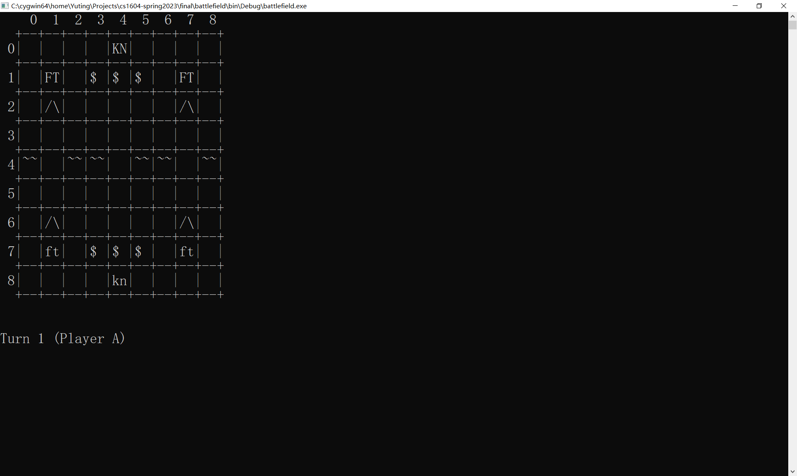


### 2. 实现单位移动（6分）

每回合玩家可以操纵它的单位进行移动：
* 一个单位每回合拥有一定的移动力：Footman移动力为4，Knight移动力为5。
* 一个单位为中心的九宫格中所有的格子都是该单位可以一步到达的范围。下图中，数字5代表单位所在的坐标，1-9代表了单位相邻的格子和移动方向，如1代表向移动到左上角的格子，2代表向上移动，等等。5代表站在原地不动。
```
1 2 3
4 5 6
7 8 9
```
* 一个格子如果已经有单位存在，那么无法移动到这个格子上。
* 每移动到一个新的格子需要消耗一定的移动力：平原需要消耗1点，树林需要消耗2点，深水和高山属于难以通过的地形，需要消耗999点移动力。
* 在实现移动命令时，你需要考虑目的地坐标是否超出地图边界。

根据上述规则，玩家每回合可以输入一连串数字并按下回车，以选择某个单位进行移动，格式如下：
```
R C D D D D ....
```
其中`(R, C)`代表选中单位的坐标（`R`行`C`列，注意不能选择对手的单位），`D`代表一连串的移动方向，如果由于移动力不足或者越界无法执行某些命令，则这些命令会被忽略。

以下面的地图为例，Player A输入`1 1 8 6 6 9 9`，代表选择坐标`(1,1)`的Footman首先向下移动，再向右移动2次，再向右下方向移动2次。由于下方高山阻挡，第一次移动无效，向右两次移动移动消耗了3点移动力，因此最后一次向右下移动由于移动力耗尽无效。最终该单位停留在了新的坐标`(2,4)`，并且轮到Player B行动。
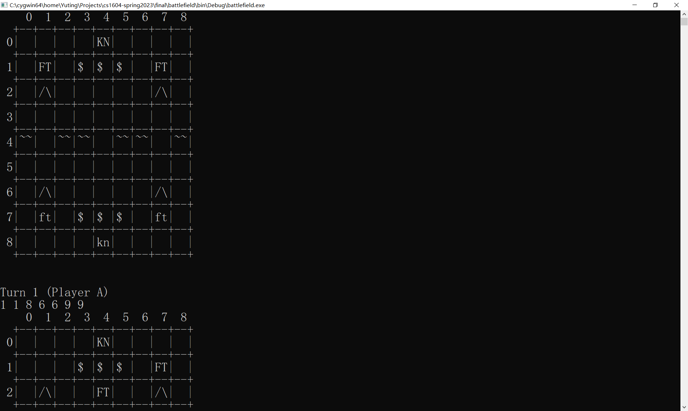
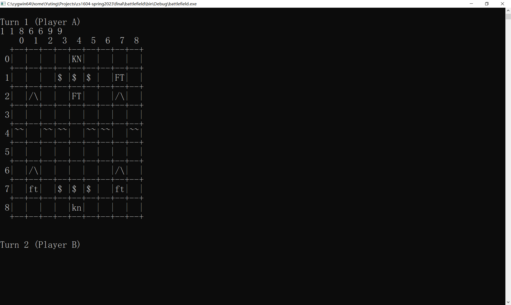

你需要添加代码以表达Footman和Knight的移动力，表示地形移动力的消耗，并在游戏引擎中实现上述功能。


### 3. 单位攻击和胜利条件（6分）

除移动外，我们将添加一个单位攻击命令，每回合玩家可以输入：
```
R C D D D D .... D 0 D
```
其中最末尾的`0 D`代表选中的单位在移动后可以选择攻击`D`方向的单位
* 默认情况下，攻击的距离为1，也就是攻击邻接单位。
* 攻击的对象可以是敌方单位也可以是己方单位。

以下面的例子为例，Player A输入`1 1 6 6 0 3`后，坐标`(1,1)`的Footman移动到`(1, 3)`并消灭了己方`(0,4)`的Knight。
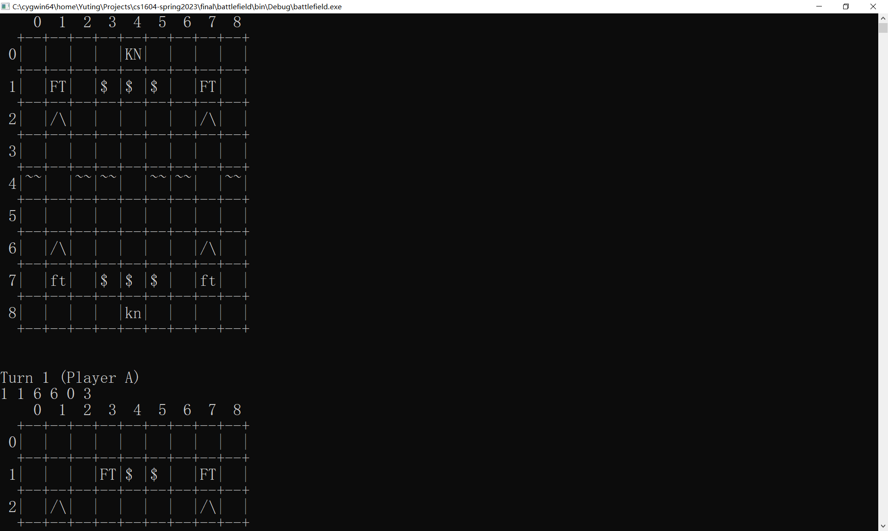


当一方消灭所有对方单位时，这方将获胜，游戏终止。**你需要实现游戏终止的检查**，并输出“Winner is Player A!"或“Winner is Player B!"，如下图所示：

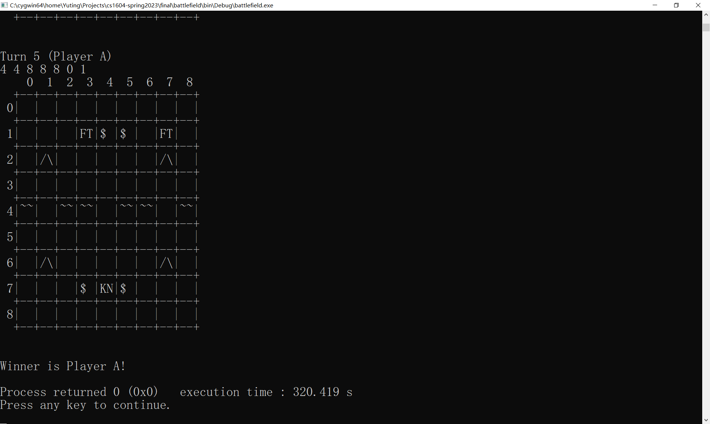

当两方单位被同时消灭时（Task 4加入的法术功能可能导致该结果），算作平手。此时应该输出"A Draw!"。


#### 3.1 弓箭手和远程攻击
除了Footman和Knight之外，我们将添加一种新的单位弓箭手(Archer)。Archer的移动力为3，地图上显示为`AR`。其特点是攻击时射程为2（不能攻击临近的格子，但是能攻击相隔一个格子的单位）。但是如果Archer和被攻击者之间有高山阻隔，则攻击失败。

如下图所示，Player A在`(3,7)`的Archer试图在移动到`(5,7)`后向下攻击对手在`(7,7)`的Footman，但是由于高山的阻隔失败。
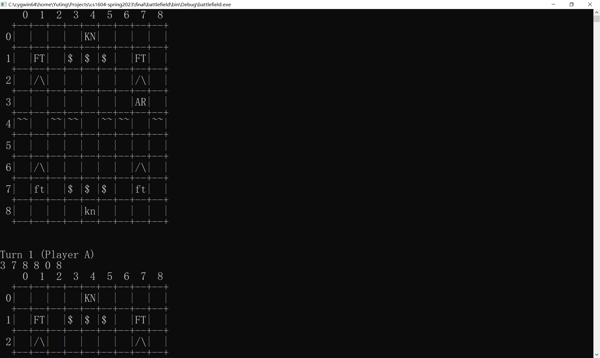


但是如果先移动到`(5,5)`位置，再向右下角攻击，则可以成功消灭`(7,7)`的Footman。
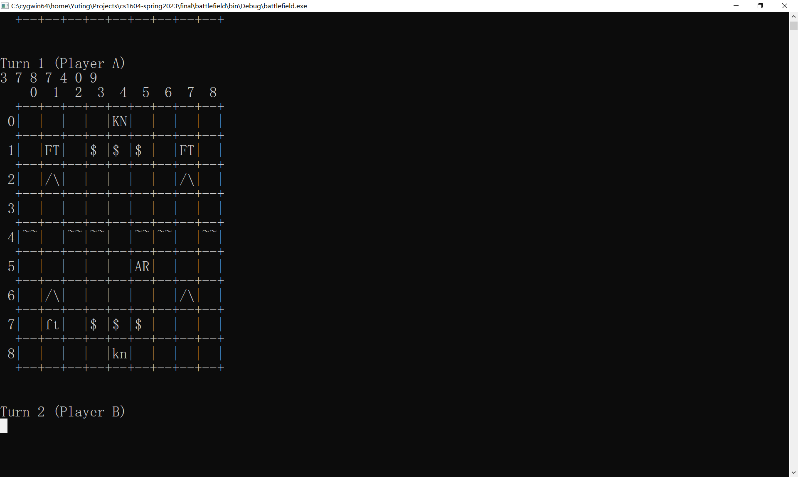


### 4. 法术和改变地形（7分）

我们最后将实现一种新的单位---法师(Mage)，其特点是无法直接攻击，但是可以施展法术来消灭对手，而且其施展的法术有可能改变地图上的地形。Mage的移动力为2，地图上显示为`MG`。

我们将添加Mage单位的施法命令，每回合玩家可以输入：
```
R C D D D D .... D 10 D S
```
其中最末尾的`10 D S`代表选中的Mage在移动后可以选择向`D`方向施法。`S`代表法术的类型，我们将实现两种法术：`S = 1`代表施展火球术(`Fireball`)，`S = 2`代表施展地震(`EarthQuake`)。

#### 4.1 火球术

效果：向指定方向释放一枚火球，产生以下效果
* 当无任何障碍物阻挡时，火球将沿着其发射的方向在地图上移动，直到超出地图边界
* 当击中某个单位时，单位将被消灭（无论敌我），火球消失
* 当击中高山时，火球将被阻挡并消散
* 当击中森林时，将在被击中的格子燃起大火，并且火势将蔓延至所有相邻的树木，并传递到其他间接相邻的树木。所有着火的森林将变为平原，并且任何在着火格子上的单位都会被摧毁。

__提示：实现火球术的关键是实现火势蔓延这一游戏逻辑。该逻辑的实现和课程作业中的Flooding逻辑类似，可以考虑如何修改Flooding的代码来达到目的。__

如下图展示了`(1,4)`的Mage发射火球击中`(7,4)`的Mage的效果。注意Player A和B的Mage都站在森林格子上。尽管`(7,4)`的Mage站在森林中，由于他优先被击中，火球消失，所以没有引发森林大火。

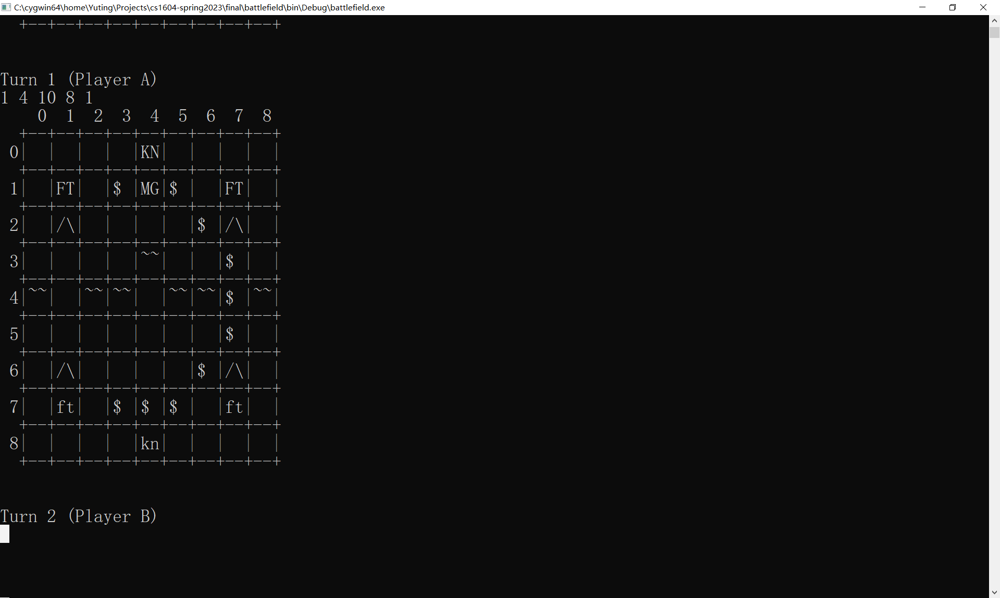
在同样的地图中，`(1,4)`首先向左移动一格，然后向下发射火球击中`(7,3)`的森林，导致森林连锁着火，将所有的树木烧光。又由于两个Mage都站在着火的森林中，它们都被火势带走。

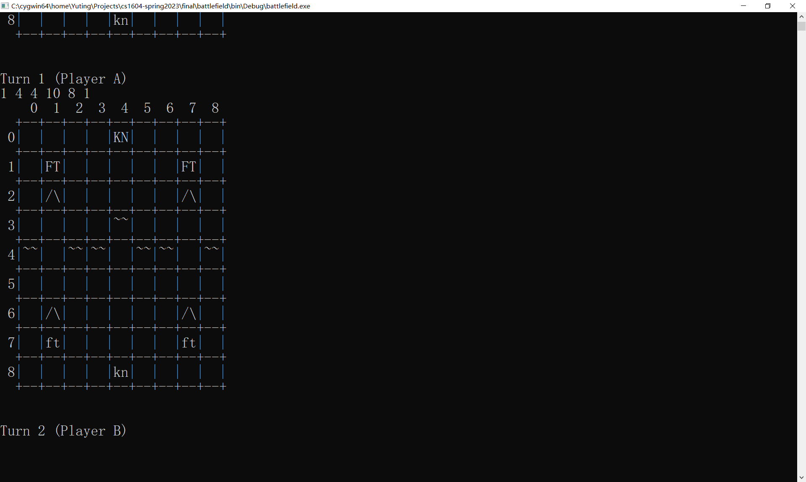
最后，下图展示了`(2,2)`的Mage移动到`(3,1)`后向下发射火球，被高山所阻挡，因而`(7,1)`的Footman毫发无伤。
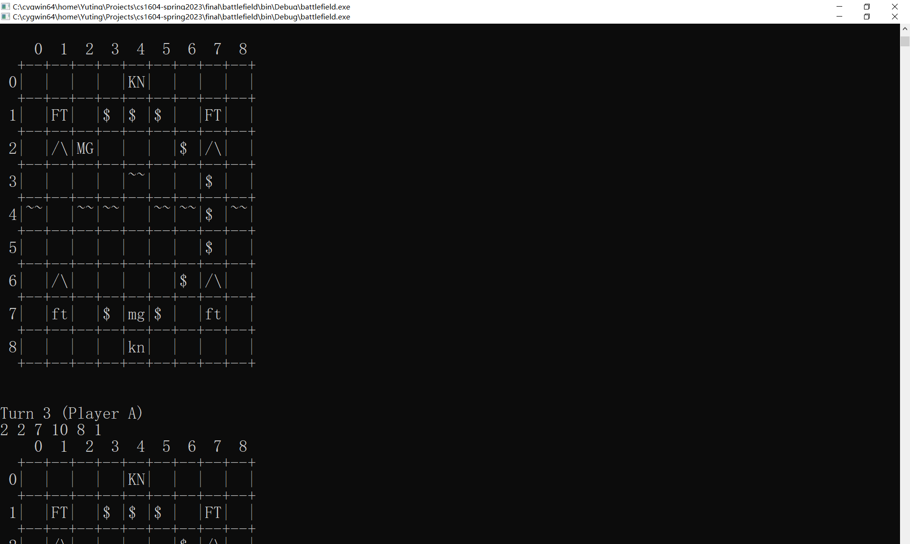
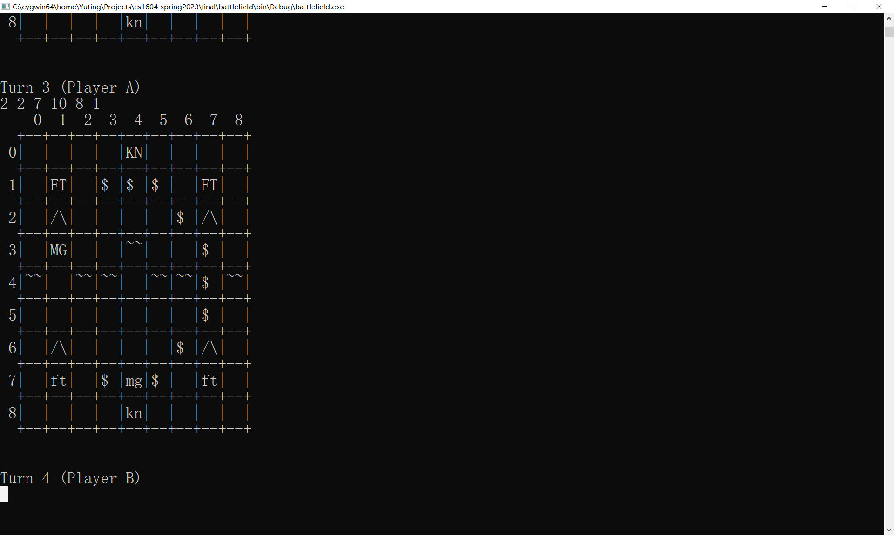


#### 4.2 新地形：深渊

我们将引入一种新的地形：深渊(ABYSS)
* 深渊的地形数据表示为`A`，地图上显示为`\/`
* 和高山、深水类似，深渊属于难以逾越地形，移动力消耗为999
* 深渊如果和深水邻接，则深水会灌入深渊，使得其地形变为深水

你需要添加新的地形(ABYSS)，并实现深渊被深水灌入的效果，该效果需要在载入地图后发生。
__提示：和上题一样，深水灌入深渊的逻辑也和Flooding类似。__

例如，下图分别显示了深渊在被水灌入之前和灌入之后的效果，我们需要看到的效果是后者（灌入之后）。

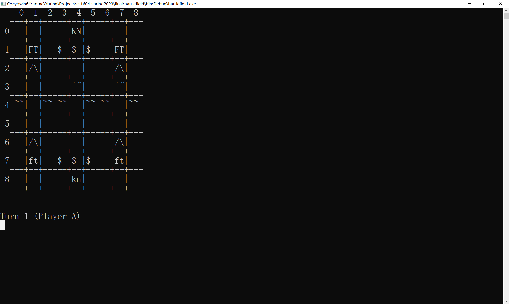


#### 4.3 地震

效果：使得指定方向的区域产生地震，地震将导致地形改变，使得某些格子变为深渊(ABYSS)，并消灭卷入地震的单位。
* 地震的施法射程为3，将以距离为3的格子为中心点，使得中心点以及它上、下、左、右、四个方向的邻接格子产生地震。例如，下面展示了`(1,4)`的Mage向下方释放地震的效果。
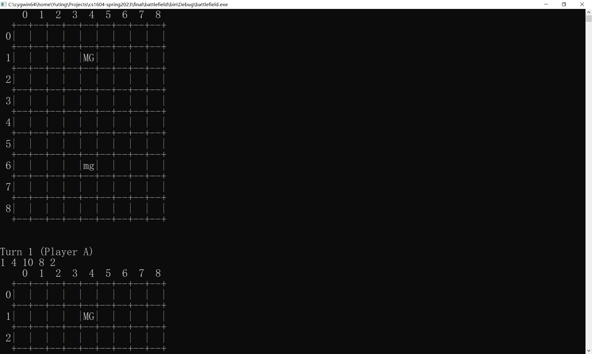
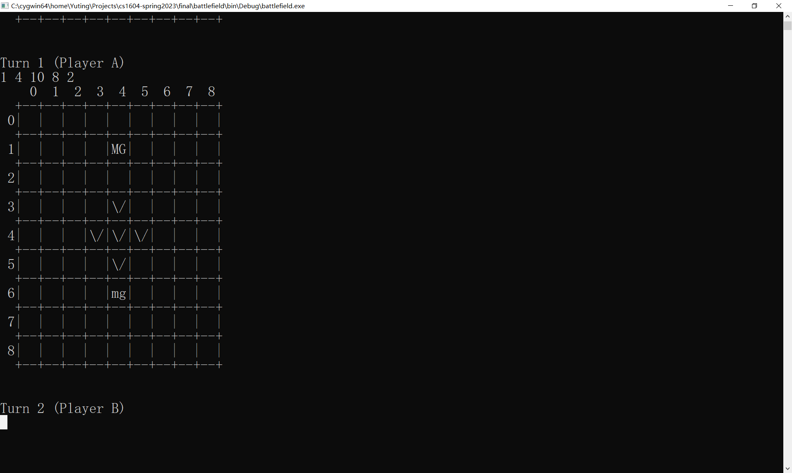

* 地震对不同的地形将产生不同效果：
  - 平原和森林在地震后变为深渊
  - 高山在地震后被夷平（变为平原）
  - 其他地形保持不变
* 地震过后，和深水相邻的深渊将被灌入，并变为深水区
* 所有卷入地震的单位将被消灭

下面的例子展示了一个更加复杂的地震效果,`(1,4)`的Mage移动到`(2,4)`然后向右方释放地震：
* 地震覆盖的范围是`(1,7), (2, 6), (2, 7), (2, 8), (3, 7)`
* `(2,7)`所在的山被夷平，其他区域变为深渊
* `(1,7)`的Footman被消灭
* 由于`(3,7)`邻接深水，导致所有的深渊被灌入，最终变为深水区。


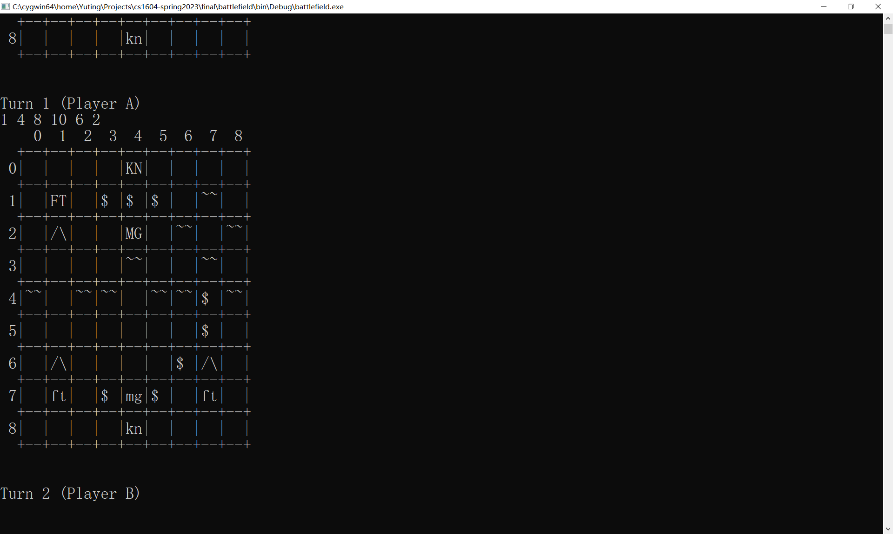

## 调试游戏

为调试游戏，你首先需要准备好一个地图，使用`loadMap`装载生成一个战场，然后在标准输入端输入命令，观察输出端的结果。主函数的示例结构如下：

```
int main()
{
    string filename = "map.txt";
    ifstream ifs;
    ifs.open(filename.c_str());
    if (!ifs) {
        cout << "Cannot open the file: " << filename << endl;
        return -1;
    }

    Field* f = loadMap(ifs);
    if (f == NULL) {
        cout << "Failed to load map!" << endl;
        return -1;
    }
    play(*f, cin, cout);

    delete f;
    ifs.close();
    return 0;
}
```

初始代码中以及准备好了2张测试地图`map1.txt`和`map2.txt`。你也可以设计自己的地图用于调试。

## 测试游戏

我们使用`judger.py`脚本做最终的测试，为此你需要将主函数改为**从`cin`中读取地图及之后的用户命令**，然后将结果输出到`cout`。每个任务我们准备了对应的测试案例，放在`data`文件夹中。**你的程序必须通过所有测试案例才能拿到对应任务的满分**。特别注意本次作业使用`StanfordCppLib`，因此需要将编译StanfordCppLib产生的cs1604文件夹的**绝对路径**复制到`source/cs1604.txt`下，以让`judger`成功编译你的程序。

然后在Windows命令行中运行
```
python judger.py -1  // 1 代表第1个任务，同理可测试2、3任务
```
如果测试通过，输出结果
```
[T1 c1] Correct
[T1 c2] Correct
...
```
如果测试不通过，则会显示输出不对应的地方。为了测试所有的结果，可以直接调用
```
python judger.py
```


## 隐藏测试（5分）
本次大作业有一部分隐藏测试用来测试**所有任务都完成的程序**各种可能出现的极端情况，**通过所有隐藏测试才可以得到满分**。该隐藏测试将不会透露给学生，所以请特别注意自行测试各类边缘情况。自行测试的结果可以和参考程序相对比，参考程序在`demo`文件夹下面。有2个版本：

* `demo1.exe`从`map.txt`中读取地图文件，然后和用户通过标准输入输出进行交互。
* `demo2.exe`从`in.txt`中读取地图文件和所有用户输入，将结果输出到`out.txt`。

前者用来做交互测试，后者用来做文件输入输出的对比测试。此外，调用demo时加上参数`-D`，将进入Debug模式，会显示更多信息。


## 提交文件格式
你需要提交的文件结构应该类似如下形式：

```
<your student number>.zip
|- main.cpp         // 程序入口
|- units.h          // 单位类头文件（访问单位的接口）
|- units.cpp        // 单位类的实现
|- field.h          // 战场类头文件（访问战场的接口）
|- field.cpp        // 战场类实现
|- engine.h         // 游戏引擎接口
|- engine.cpp       // 游戏引擎的实现（包括和用户交互）
|- cs1604.txt (include the StanfordCppLib) 
```
